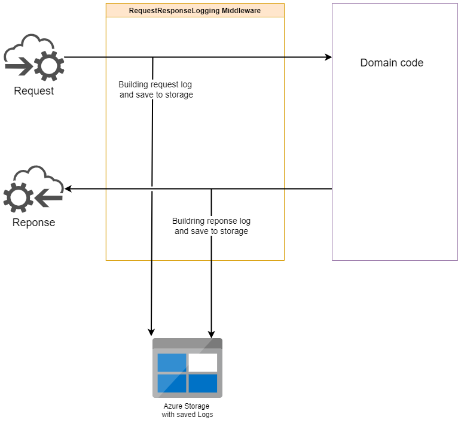

# Logging Middleware for Request and Response

Middleware logs request and response to external storage.

Request and response stream should be seekable for the middleware to read stream multiple times.

Implementation example:

    builder.UseMiddleware<RequestResponseLoggingMiddleware>();
---

    Container.Register<RequestResponseLoggingMiddleware>(Lifestyle.Scoped);
---

    serviceCollection.AddScoped<IRequestResponseLogging>(
    _ => new RequestResponseLoggingBlobStorage(connectionString, 
                                                containerName, 
                                                ILogger<RequestResponseLoggingBlobStorage>));

## Architechture

Request and response logs are created and saved to storage for later processing.

## App Release notes

[Release notes](/release-notes/release-notes.md)